# 问题背景
## 浮点数乘法的性能异常

在《数据结构基础》课程 Project 1 中，我们需要评估一段计算幂运算代码的运行耗时，以此分析它的时间复杂度。幂运算的算法相对比较简单，下面是一段示例代码:

```c
double pow(double init_val, uint64_t iteration) {
  double mx = init_val;
  for (uint64_t i = 1; i < iteration; i++) mx *= init_val;
  return mx;
}
```

从代码中我们可以推出其运行时长应该只与 iteration 变量线性相关，对应该算法复杂度为 $O(N)$. 

然而一部分同学在进行实验时，发现这段代码的运行耗时不仅与幂次方有关，还与底数 init_val 有关。更具体而言，当底数比较大时，性能会发生骤降，比如计算 $1.5^n$ 会比 $1^n$ 慢十几倍。

在讨论过程中，同学们初步推断出，由于幂函数增长速度很快，计算较大底数时，很快就会超过 double 类型能表达的数字上限，此时结果将会变为 inf。因此问题的本质不在于底数的选择，而在于运算过程中是否发生了上溢 (overflow) 的问题，如果发生了上溢，那么性能就会骤降。

还有热心的同学提供了在不同平台的测试，确定了在 x86 架构的两家厂商中，Intel CPU 广泛存在该问题，而 AMD CPU 不受影响。同时，通过改变编译器版本编译同一段代码，可发现该问题存在于老版本的 gcc 编译器中。分析其产生的汇编代码，会发现老版本 gcc 编译器默认使用 x87 浮点数单元，而新版本编译器至少会启用 SSE 进行浮点数运算。

于是我们的问题就进一步缩窄为了: 在 Intel CPU 上，使用 x87 浮点数运算单元时，对非规格数参与的浮点数进行处理时，发生性能骤降的原因。

在探究问题之前，有必要对 x87 浮点运算单元进行详细的了解与分析，以便提出合理猜想并找到验证途径:

## 8087 与 x87 浮点运算单元

在 8086 时代，实际上处理器硬件是不具有浮点数处理能力的，想要进行浮点数运算，一种方法是使用软件模拟，另外一种方法是外挂一个浮点数协处理器 (co-processor). Intel 8086 发布于 1976 年，但当时监督 8086 开发的工程师 Bill Pohlman 在设计之初就确保 8086 能够适配一款当时仍处于构思阶段的浮点数协处理器。

这款浮点数协处理器就是 8087, 发布于 1980 年，也就是 8086 发布后 4 年。8087 是世界上第一款浮点数协处理器，实现了浮点数运算的硬件支持。它不仅可以完成浮点数的基本四则运算，还可以完成三角函数、对数、乘方等等多种丰富的运算，极大地提升了计算机的浮点数运算能力。

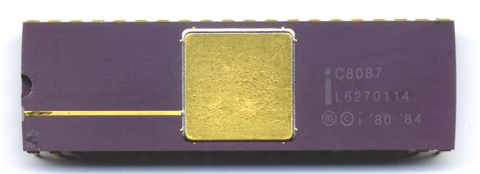

8087 逻辑上可以分成两大部分，控制单元和运算单元。控制单元与 8086 处理器相连，并维护两个重要的处理器: Control Word 与 Status Word, 前者控制了 8087 的行为，比如是否处理异常，浮点数的舍入模型等等，后者类似 flags 寄存器，表示当前 8087 处理器的状态。运算单元的核心是一个能存储 8 个 80 位浮点数的寄存器栈，对应地，向 8087 存储和读取浮点数的操作也均是以栈操作的语义实现的，也就是压栈 push 和出栈 pop. 8087 内部的 ROM 上存储了 $\pi$, $e$, $\ln 2$ 等常数，配合微码控制的运算电路，可以实现各种复杂的浮点数操作。

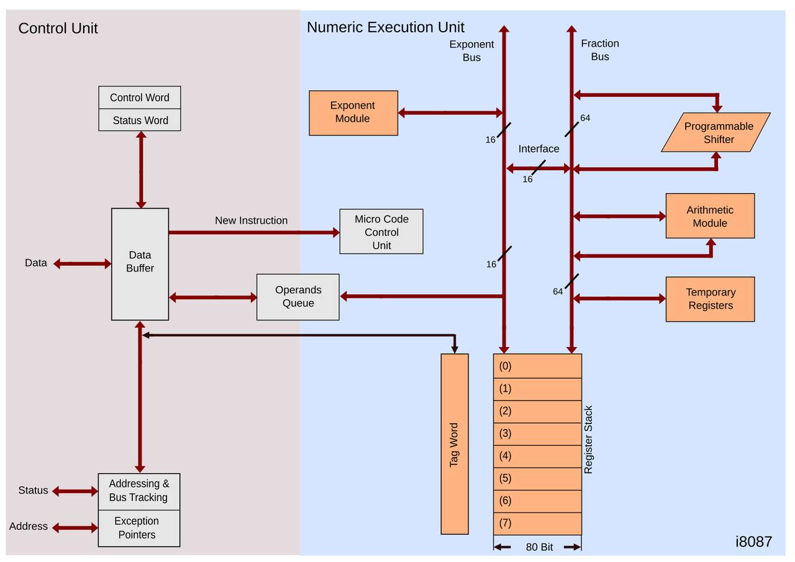

这篇博客从 die shot 与电路层面，详细剖析了 8087 处理器内部的寄存器以及负责运算的电路的结构：https://www.righto.com/2018/08/inside-die-of-intels-8087-coprocessor.html . （尽管与现代 x87 的硬件实现已经大相径庭，但哪个男孩不喜欢欣赏电路之美呢）

## 8087 与 8086 的同步

早期 8087 作为一款协处理器，需要与 8086 处理器进行沟通才能实现浮点数运算的功能。这一方面是指 8086 需要向 8087 发送控制与数据信号，指定 8087 完成对某一浮点数的具体操作，此时 8086 需要等待 8087 完成运算，才能进行下一条指令的执行。另一方面，8087 在运算时如果产生异常，也需要 8086 进行后续的处理。

在指令编码上，8087 相关的指令都以 0xdf-0xdf 之间的前缀开始，这一前缀代表 Escape to co-processor, 使 8086 执行到相关指令时，8087 能够获得指令并进行解码。8087 的运算与 8086 的指令执行是异步的，如果想要得到正确的结果，就需要等待 8087 完成处理器与协处理器之间的同步。同步过程在 Intel 的设计下是显式地，必须调用一条 fwait 指令来完成。此时 8086 会停下脚步等待 8087 的浮点运算，然后检查是否有异常产生，再进行后续的处理。这条 fwait 指令不需要程序员自行添加，当时的汇编器能够自动地在 8087 浮点指令后插入 fwait 来进行同步。https://stackoverflow.com/questions/42543905/what-are-8086-esc-instruction-opcodes

## 现代 x86 处理器与 x87 相关的控制位及异常

尽管现在 x87 协处理器已经变成了 x86 处理器内置的浮点单元了，在 Intel 64 和 IA-32 处理器中，仍然能够看到诸多 x87 的身影:

- CR0 寄存器: 在课程中，我们学习到 CR0 控制了 CPU 的保护模式和内存分页机制，是 CPU 上尤为重要的一个控制寄存器。在如此重要的 CR0 中，有四位是与 x87 处理器直接相关的:

    - ET (Extension type): 用于区分 x87 协处理器的种类，若为 1 则为 Intel 387 DX 及之后，为 0 则代表 Intel 287 及之前的 x87 协处理器。在现代 CPU 上这一位恒为 1.
    - MP (Monitor Co-processor): 用于控制 wait/fwait 指令是否产生 #NM (Device not available) 异常，现代处理器不需要该机制，且推荐设置恒为 1.
    - EM (x87 FPU Emulation): 用于控制是否开启模拟 x87 的软件浮点运算，如果 EM 置为 1，那么任何 x87 指令将会导致 #NM 异常，程序员需要在异常处理中进行软件浮点数模拟。同时将会禁止其他浮点指令，如 MMX, SSE 扩展等等，否则会产生 #UD 异常。
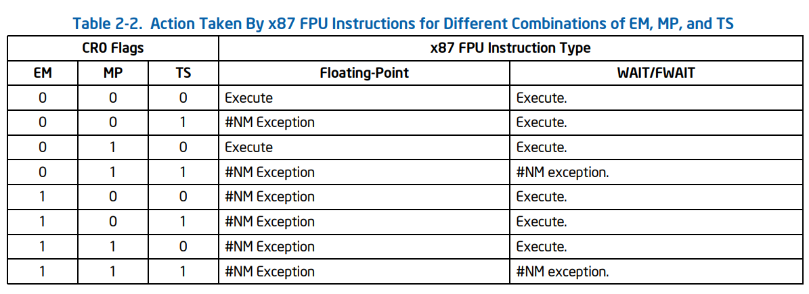
    - NE (Numeric Exception): 用于控制 x87 异常的处理方式，若为 1，则由 CPU 内部通过 #MF 异常进行处理，否则将通过外部硬件的中断请求线同志外部设备，借助外部硬件的逻辑来处理该异常。

> The NE (Numeric Exception) flag (bit 5 of the CR0 register) is used in the P6 family, Pentium, and Intel486 processors to determine whether unmasked floating-point exceptions are reported internally through interrupt vector 16  (flag is set) or externally through an external interrupt (flag is clear). On a hardware reset, the NE flag is initialized  to 0, so software using the automatic internal error-reporting mechanism must set this flag to 1. This flag is nonexistent on the Intel386 processor.
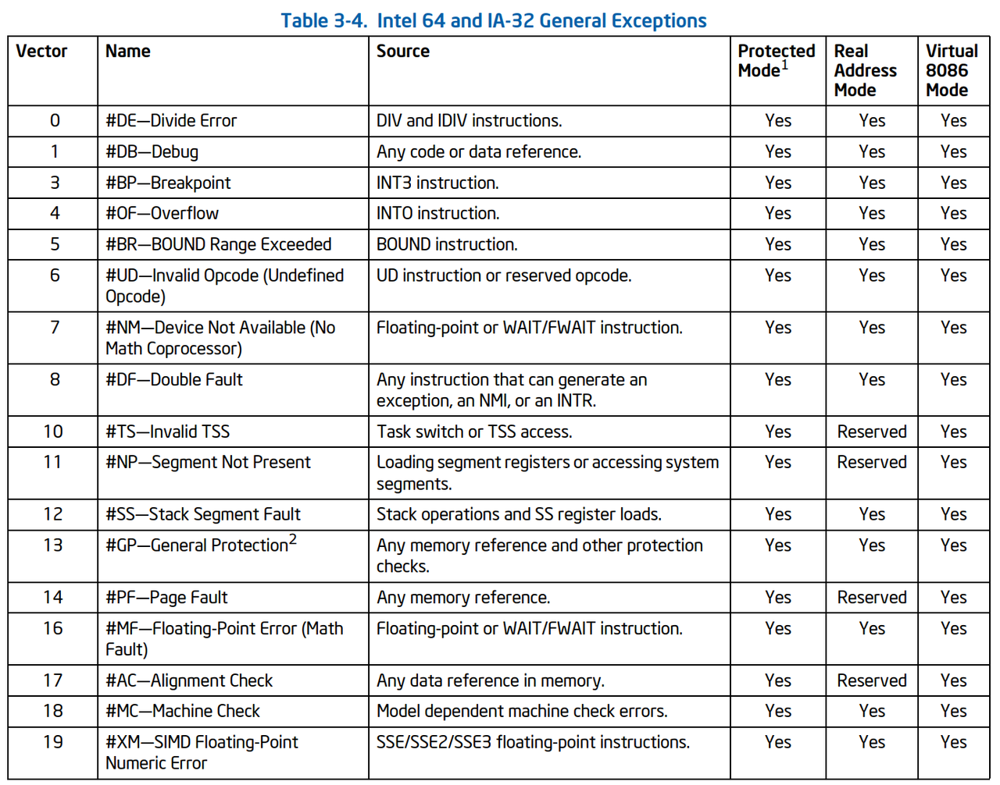
- x87 控制寄存器 （Control Word）
  - RC 与 PC 控制 x87 的舍入与精度
  - 低 6 位为 Exception Mask，如果置 1，该类异常不会被触发
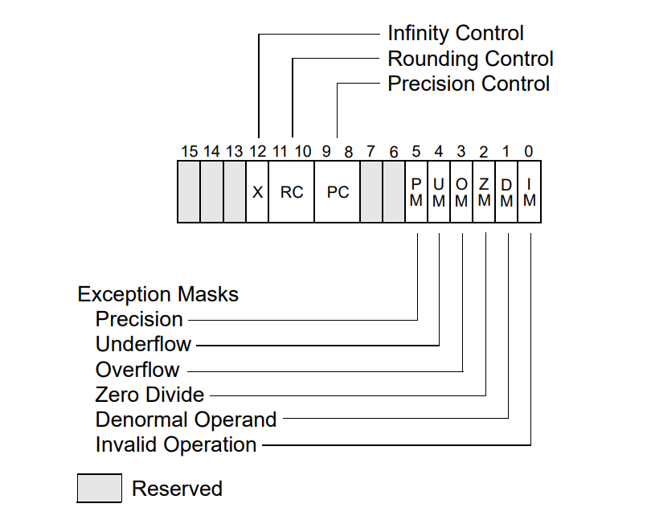

## IEEE 754 标准

IEEE 754 标准是目前广泛接受与使用的浮点数运算标准，它定义了浮点数的格式和操作，确保了不同计算机系统间浮点运算结果的一致性。从历史角度来看，IEEE 754 标准收到了 8087 协处理器的显著影响，因为 Intel 8087 是历史上第一款硬件浮点协处理器，引入了浮点数的基本概念、运算操作和一些特定的异常处理方法。IEEE 754 标准的许多核心概念，比如舍入模式和异常的定义，都在 8087 中有所体现。可以说 8087 为 IEEE 754 标准的诞生奠定了基础，而 IEEE 754 标准在后来的处理器设计中进一步推广并完善了这些理念，后来 IEEE 754 又反向影响了 80387 及以后 Intel 的浮点数处理单元的规范化设计。

### 扩展精度格式
在 x87 FPU 中，浮点数位数均为 80 位，这一格式在 IEEE 754 中被规范化为扩展精度格式，它包括 1 位符号位，15 位指数位，以及 64 位尾数。其规定的无穷大以及 NaN 数值如下表所示:
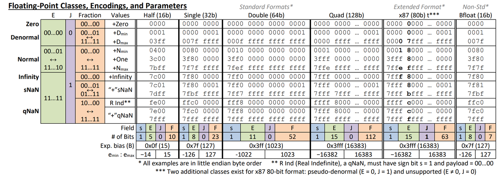

### 非正规数的运算
Intel 浮点数参考手册 详细介绍了 SSE 和 AVX 指令对 normal / subnormal / denormal 数字以及他们之间进行运算时产生的结果以及异常位设置。除了异常种类不同，以及 x87 没有 DAZ (Denormal as zero) 以及 FTZ (Flush to zero) 设置之外，其结果应该是相同的:


# 探究过程
## 猜想 1: 与 x87 异常产生的中断和操作系统处理有关
### 分析

在对 x87 进行详细介绍的时候，我们提到 CPU 有多种异常与 x87 有关: 一方面，x87 本身会产生 P, U, O, Z, D, I 这 6 种异常，另一方面，在 x87 运算的过程中，还有可能触发通用异常 #NM, #MF 等等。我们知道一旦发生异常，就会导致 CPU 需要跳转到操作系统指定的代码进行处理，打断原先程序的执行，严重影响性能。

我们先来分析 x87 本身的异常。在 x87 FPU 的控制寄存器 fpcw 中，存储着异常的掩码 (mask)，一旦对应位置 1， 就代表这一类异常被掩盖住，不会报告给操作系统。

通过 fnstcw 指令可以获取 fpcw 寄存器的值。在不做任何操作的情况下，可以看到 fpcw 的默认值为 0x037F, 也就是说默认所有的异常都被掩盖住了。

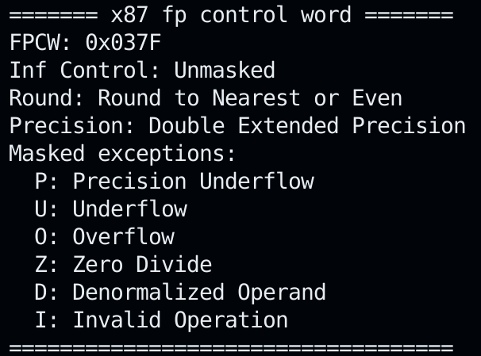

如果手动设置 fpcw，将对应的 mask 位解除，在程序没有声明自己的浮点异常处理函数时，会上报给操作系统产生 floating point exception, 并结束程序运行。这与我们问题背景里的情况不太相同，说明原问题并不是因为 x87 本身的异常导致的。


然后我们可以分析一下是否产生了 CPU 的通用异常。cr0 是设置与 x87 相关异常的关键寄存器，但通过分析，在现代的 CPU 上，我们实际可以设置的只有 cr0.ne 这位可能会有效果。这个寄存器需要 Ring 0 级别的权限才可以运行，所以我写了一个 Linux 内核模块:

```c
static int __init cr0_ne_init(void) {
    unsigned long cr0;

    cr0 = read_cr0();
    pr_info("Original CR0: 0x%lx\n", cr0);
    pr_info("Original CR0.NE: %lu\n", (cr0 >> 5) & 0x1);

    // 清除 CR0.NE 位（第5位）
    cr0 &= ~(1UL << 5);
    write_cr0(cr0);

    cr0 = read_cr0();
    pr_info("Modified CR0: 0x%lx\n", cr0);
    pr_info("Modified CR0.NE: %lu\n", (cr0 >> 5) & 0x1);

    return 0;
}

static void __exit cr0_ne_exit(void) {
    unsigned long cr0;

    // 恢复 CR0.NE 位（设置第5位）
    cr0 = read_cr0();
    cr0 |= (1UL << 5);
    write_cr0(cr0);

    pr_info("CR0.NE restored.\n");
}
```

我在我的笔记本上安装了原生的 Linux 环境，加载该内核模块后，可以在内核消息 dmesg 中看到寄存器成功被修改，但是运行先前的测试，依旧可以观测到性能骤降的问题。这说明实际上这个问题与 cr0.ne 没有关联。

### 实验

除了在分析部分体现的小实验外，我还尝试在各种平台、各种操作系统上广泛地尝试。
我的测试平台为 Intel Core i7-12700H, Intel Celeron 3865U, 以及 Intel Xeon Gold 5320。Intel Core i7-12700 H 为 12 代笔记本 CPU，微架构为 2021 年发布的 Alder Lake;  Celeron 3865U 来自我的一块工控板（其命名是致敬 80386 的），属于低端嵌入式产品线，微架构为 2016 年发布的 Kaby Lake; Xeon 5320 为 Inel 第三代志强服务器处理器，微架构为 2019 年的 Ice Lake。这三款 CPU 覆盖了英特尔的 Core、Celeron、Xeon 多个产品线，覆盖了跨度较长的微架构设计，应当具有足够的普遍性。

测试用到的代码附在作业提交的文件中，代码可以自动对比 x87 与 SSE、AVX 在不同输入（正负 INF， NaN，下溢等）、不同操作（乘法、加法）之下的性能表现。

首先是 Windows 平台，测量于 Intel i7-12700H:

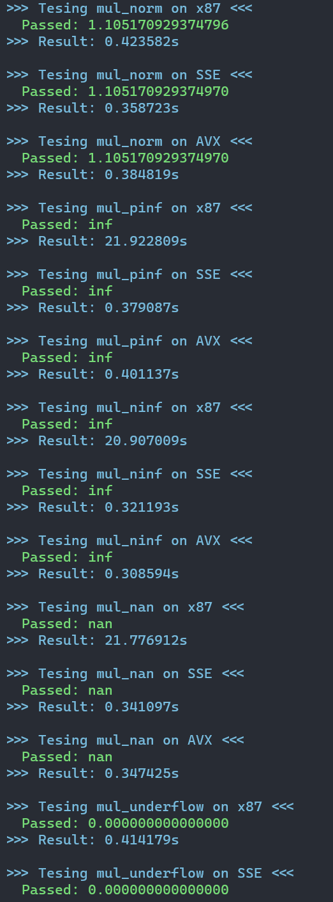

其次是 Linux 平台，测量于 Intel Xeon 5320:


在两个平台上，可以观察到 x87 对于 INF 和 NaN 参与的运算，性能显著低于 SSE 与 AVX，而下溢出 (underflow) 的时间则相近。

最后我还为 Celeron 3865U 平台安装了 FreeDOS，一款开源的仿 MS-DOS 系统，它支持在现代的平台上继续运行 DOS 系统。FreeDOS 相较于其他两款操作系统，由于可以直接跑在实模式下，且程序运行时具有完全的权限，能够排除很多软件层面的影响。在 FreeDOS 系统下，我选择了 bcc 编译器和手写一个简单的测试程序，因为编译器和构建系统完全不同，只测试了 mul_norm 和 mul_pinf 两种情况。在 FreeDOS 系统中，可以观测到 mul_pinf 的速度显著低于 mul_norm，也可以进一步引证性能异常与操作系统和软件基本无关，属于硬件机制。

## 猜想 2: 与 CPU 对 x87 异常的处理的微码辅助有关
### 分析

perf 是 Linux 上的一款性能分析工具，它可以读取 Intel 提供的性能计数器 (PMU, Performance Monitoring Units) 获取影响 CPU 性能因素的一手数据。perf 可以测量的指标包括 CPU 发射的指令数量，程序运行的总周期数等等，进而可以计算 CPI 等指标衡量 CPU 的性能释放情况。

在 perf 支持的观测指标中，有一系列与浮点数相关的指标，这吸引了我的兴趣:

```bash
$ perf list | less
...
floating point: 
  arith.fpdiv_active                                 
       [ARITH.FPDIV_ACTIVE] 
  assists.fp                                         
       [Counts all microcode FP assists] 
  assists.sse_avx_mix                                
       [ASSISTS.SSE_AVX_MIX] 
  fp_arith_dispatched.port_0                         
       [FP_ARITH_DISPATCHED.PORT_0] 
  fp_arith_dispatched.port_1                         
       [FP_ARITH_DISPATCHED.PORT_1] 
  fp_arith_dispatched.port_5                         
       [FP_ARITH_DISPATCHED.PORT_5]
 ...
```

我挑选了所有可能与 x87 相关的指标进行了测试，并观察他们的性能指标，果真发现了端倪: 其中 assists.fp 这个指标二者差异很大，而且在异常时，数量极其接近我设置的迭代次数:


说明这个指标是我们探究问题真相的关键! 首先看它的介绍:
```bash
   assists.fp                                         
       [Counts all microcode FP assists]
```

也就是统计了在浮点数运算时微码辅助的次数。微码辅助是 Intel CPU 的一种机制，可以结合下图来理解:


这是一张 Intel CPU 微架构的示意图，其中绿色的是我们可见的 x86 指令，而在 Intel CPU 运行的时候，这些 CISC 指令都会被转换为类似 RISC 的指令——微码 (microcode)。在 Intel CPU 中，有一个单元叫做 Microcode Sequencer，用来从 MS ROM 中读取微码并执行。微码辅助发生在 CPU 内部出现异常并且没有能够处理的硬件单元时，此时前端的指令解码和后端的乱序执行都会被打断 (Machine Clear)，转而启动 Microcode Sequencer 调出处理对应情况的微码并执行。

这里有一个非常影响性能的操作 —— Machine Clear，如果进一步翻阅英特尔手册 Intel® 64 and IA-32 Architectures Optimization Reference Manual 可以看到如下的描述:


这完全符合我们所遇到的情况，只不过我们的情况是 subnormal 而非 denormal 数，不过都需要微码来辅助处理结果。进一步用 perf 查看 machine clear 的情况，可以发现它的次数和异常出现次数、迭代次数基本一致，并且远远超过无浮点异常的情况。

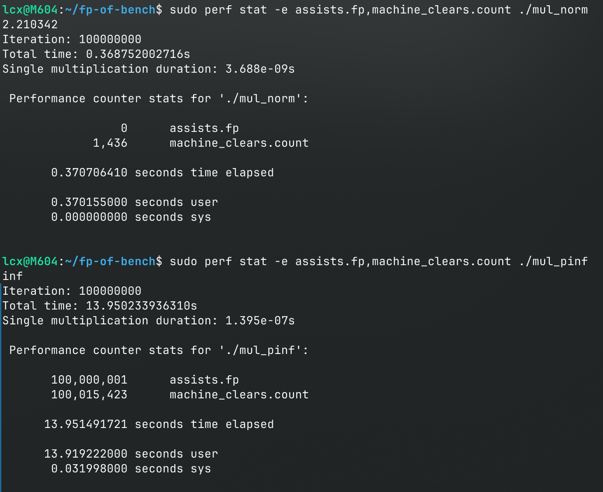

接着这个分析，我们可以尝试回答这三个问题了:

1. 为什么 x87 的指令在异常时会如此之慢？

> Some instructions (FSIN, FCOS, and other transcendental instructions) are decoded with the assistance  of MS-ROM. Frequent occurrences of instructions that required assistance of MS-ROM to decode complex  uop flows are opportunity to improve instruction selection to reduce such occurrences. The UOPS_DECODED.MS event can be used to identify code regions that could benefit from better instruction selection. Other situations that can trigger this event are due to FP assists, like performing a numeric operation on  denormalized FP values or QNaNs. In such cases the penalty is essentially the uops required for the assist  plus the pipeline clearing required to ensure the correct state. Consequently this situation has a very clear signature consisting of MACHINE_CLEAR.CYCLES and uops  being inserted by the microcode sequencer, UOPS_DECODED.MS. The execution penalty being the sum  of these two contributions. The event codes for these are listed under D1H and C3H. —— Intel® 64 and IA-32 Architectures Optimization Reference Manual

英特尔对于现代 CPU 上的 x87 FPU 的实现依然比较“原始”，但凡涉及到较复杂的处理，能不新设计硬件就不新设计硬件，所以比较复杂的三角函数 (fsin, fcos), 以及像 denormal / subnormal 数的处理，统统使用微码来实现。这就导致在使用 x87 FPU 的时候，稍不注意就有可能遇到异常情况，必须要通过 Machine Clear 打断流水线，从微码 ROM 中调出处理的微码，极大影响了现代 CPU 指令级并行的性能。

2. 为什么 SSE，AVX 等浮点数运算不会遇到这种情况？

在设计现代浮点处理单元的时候，就不需要再考虑一些历史遗留问题了，可以设计新的硬件、新的指令体系等等。因此在 SSE，AVX 等运算单元中，对 INF， NaN 这些数字的处理实际上做到了硬件中:


在新的浮点运算单元中，如果出现了 subnormal / denormal 数，甚至连运算都不会开始，直接根据 DAZ / FTZ 标志，以及对应异常的掩码产生对应的结果，大大加速了异常处理的效率。因此并不会遇到性能骤降的问题。

3. 为什么 AMD CPU 的 x87 单元没有这种现象？

在一篇 2003 年对 AMD Opteron CPU (首个 64 位CPU）微架构的分析技术博客 Detailed Architecture of AMD's 64-bit core 中，有如下的叙述:

> The result of all AMD's x87 optimizations is that the Opteron literally runs circles around the Pentium 4 when it comes to x87 processing. It has removed large special purpose circuits for status processing and implemented a few small ones that handle the cases mentioned. The shift to SSE2 floating point however will make removed area overhead more important than the speed-ups.
>
> AMD 的所有 x87 优化的结果是，Opteron 在 x87 处理方面确实比 Pentium 4 更胜一筹 （原文是：在跑步时可以“套圈”）。它移除了用于状态处理的大型专用电路，并实现了几个处理上述情况的小型电路。然而，转向 SSE2 浮点将使消除面积开销比加速更重要。

也就是说自 AMD 的第一代 64 位 CPU 起，AMD 就对 x87 FPU 进行了大刀阔斧的改造，将很多异常处理机制从微码辅助变成了硬件功能，从而极大地加速了 x87 的性能。在我的 AMD Ryzen 7 7840HS 上经过实测，即使是 x87 运算，也不会出现性能骤降的问题。

尽管当时 x87 FPU 已经是比较古老的单元，技术的主流是使用 SSE （或者 AMD 更早的 3DNow!）等新的浮点运算指令，AMD 还是对这个不起眼的浮点单元进行了细致的优化，并且领先了 Intel 20 年。反观 Intel，明明已经知道这个问题，还把它写进了手册里，但是就是不愿意优化自己的硬件，而是将其责任推给程序员，说是程序员还在使用 x87 指令的错，他们应该升级自己的技术栈。AMD 和 Intel 对待这个问题态度的反差，结合两家企业目前发展的现状，实在令人唏嘘不已。

### 实验
1. 手动插入需要 Microcode Assist 的指令 cpuid

我写了下面这个小程序，使用 cpuid 来强制触发 Machine Clear，并期望得到原本正常的运算，添加 Machine Clear 之后性能降低的现象

```c
void trigger_machine_clear() {
    uint32_t eax, ebx, ecx, edx;

    asm volatile(
        "cpuid"
        : "=a"(eax), "=b"(ebx), "=c"(ecx), "=d"(edx)
        : "a"(0)
    );
}

int main() {
    // Example function that performs floating point operations
    double a = 1.0, b = 1.00000001;
    for (int i = 0; i < 1e8; ++i) {
        a = a * b;
#ifdef MACHINE_CLEAR
        trigger_machine_clear();
#endif
    }
    return 0;
}
```

结果如下:


可以看出结果符合我们的预期，原本 0.3s 完成的运算，现在需要 4.2s 才能完成，慢了超过 10 倍。在 eax = 0 时，cpuid 指令只是往寄存器里写入 GenuineIntel 这个字符串而已（可以参考报告接下来的部分），微码操作 uops 数量要比浮点数异常处理少，因此并没有相差像出现 x87 浮点数异常那么多倍。

2. 使用 Intel VTune Profiler 进行性能分析

Intel VTune Profiler 对 Machine Clear 和 FP Assists 的介绍和优化建议:

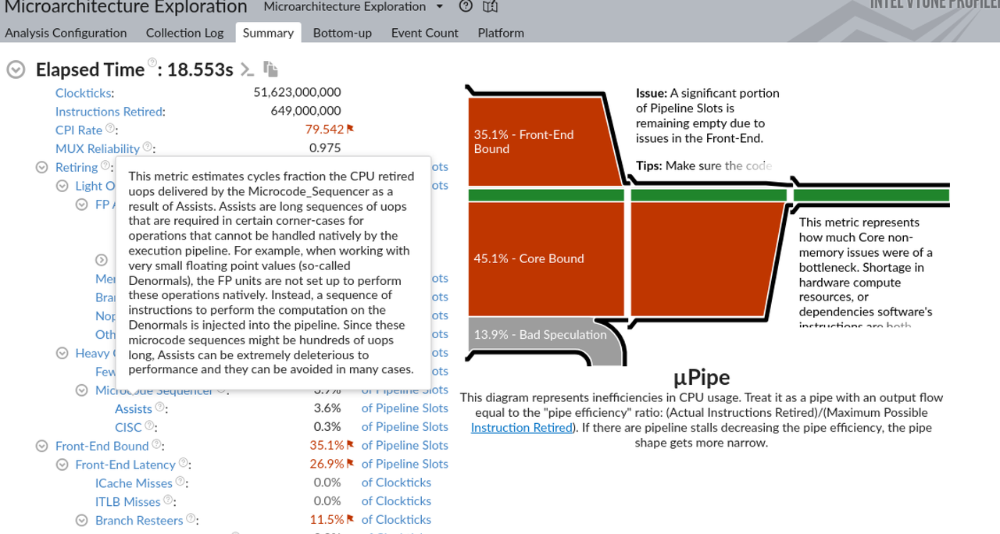

从上面可以看出 Intel 实际上是知道 x87 对于 denormal 数处理的性能问题的，它给出的建议就是不要用 x87.

在进行有浮点数异常（subnormal）的实验时，VTune Profiler 测量出这条关键指令的 CPI 甚至达到了 57.5，说明这条指令尤其地慢:


而如果不出现异常的 normal 情况，那么最慢的指令就是受制于运算的 fmul, 但 CPI 也仅仅只有 8.6, 相较 57.5 小很多:

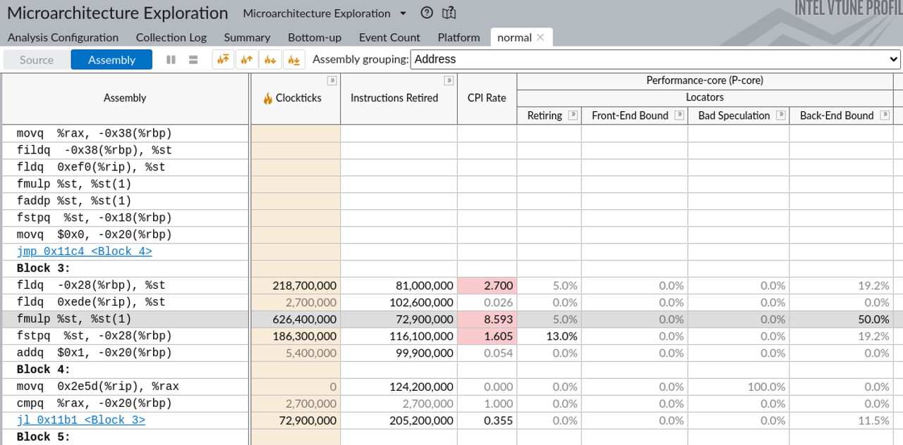

## 一种有力的验证方法

1. 使用 Red Unlock 解锁使用 Intel Goldmont 微架构的 CPU

如果问题出在微码辅助，那么我们把微码机制改掉不就好了？小白老师说过 `If it runs, it can be hacked`. 看似坚不可摧的商业机密——微码，又怎能逃脱被破解的命运呢？Chip Red Pill 团队在 2020 年成功破解了 Intel Goldmont 微架构 CPU 的微码，获取了完整的 MSROM dump，分析出了微码指令的结构与功能，甚至还发现了修改微码的方法。这使得我们看似疯狂的想法成为了可能。所以在这一部分我想讨论一下，如果我们能够修改微码，该如何进一步认证我们的猜想。

2. 通过 hook 动态测试 x87 FPU 异常时所调用的微码区域

尽管有完整的微码内容，x86 指令的微码之间的关系，也就是微码指令的入口点仍未揭晓。
想要获得 x86 指令，比如 div 等指令的具体入口，有两种方式:

第一种是静态分析: xxx 提到，x86 指令的微码入口主要位于微码文件 U0-U1000 的位置，且在微码内部无该地址的引用。利用 Ghidra 反汇编代码，高手可以直接通过逆向的经验和对 x86 指令集极深的理解，直接推测对应的指令。比如一些会改动寄存器的指令，就可以通过这种方式推测出来。以 cpuid 指令为例，该指令有一隐藏操作数 eax，若 eax == 0，则会向 ebx, ecx, edx 这三个寄存器中写入 GenuineIntel 字符串，代表 CPU 的生产厂商。在 Ghidra 反汇编的代码中，可以很清晰地看出这部分的逻辑:

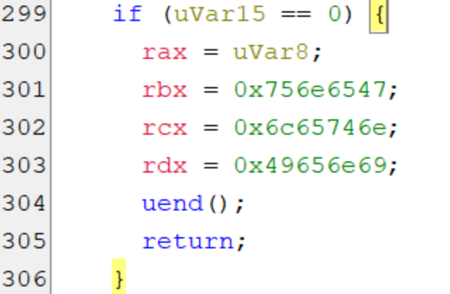

通过立即数以及对寄存器的操作，便可以推测出该微码操作属于 cpuid 指令。

这种方法对分析者的要求极高，且微码仍有很多目前尚未探明的操作，Ghidra 反汇编出的逻辑也不是很清晰，因此很难分析出结果。我想这也是原破解团队仅仅公开了极少数 x86 指令入口点的原因。

我最开始也想过硬着头皮直接去逆向，并且想到了下面的两种思路:
  1. 从立即数入手

在 hard_imm.txt 中可以看到，IEEE 754 编码的 32 位浮点数 INF 0x7f800000 和 NaN 0x7fc0000 都存在，如果能找到对这些立即数的引用，或许就能找到与浮点数处理相关的微码操作。

可惜的是，直接搜索这些立即数，要么是无结果，要么是找不到有意义的微码操作。这是因为在微码程序中，由于经常要读取和设置状态位，里面存在大量的位运算，这也就是说 INF 和 NaN 的判断可能是通过多次位运算进行检测的，而不是直接与立即数进行比较。我搜索了立即数的一部分，比如 0x7ff, 0x7fc 这样的立即数，以及 0x (十进制 52) 这样的偏移量，仍未找到。

我还搜索了 Pi 这样的常数，这是因为在 x87 依旧是独立于 x86 处理器的浮点单元，也就是 8087, 80287 时代，Pi, e, ln2 这样的常数都是编码在 x87 ROM 当中的，甚至找到爱好者根据 die shot 推测 ROM 内容的文章: . 但是，这些常数并未编码于微码 ROM 中，或许已经做在运算单元中了。

  2. 从异常入手

原破解团队在公布的代码中找到了生成 #GP, #UD, #MC 这三个异常的微码入口点，并指出 sigevent 操作与其直接相关，但 sigevent 的立即数与异常的具体关系尚不明晰。

与 x87 FPU 相关的异常有 #OF 溢出异常，以及 # x87 FPU 异常。

然而，搜索全部的 sigevent 操作，可以发现后面的立即数不尽相同，不能通过某个异常的频次分析出这个异常可能是哪个。

综上，这两种思路虽然很有希望，但还是极其困难的，最终我没有得到结果。

第二种是动态测试: xxxx提到，可以使用插桩+模糊测试的方式来找入口。e这种方式首先设计了一段微码操作“函数”，可以被调用，且可通过性能寄存器观测出是否被执行，然后不断遍历入口点，将入口点修改为跳转到该指令的微码操作。这样一旦设计的函数被调用，就说明找到了该 x86 指令对应的入口点。

我认为这种方式虽然暴力，但应该也是目前的唯一可行解了。不过这种方法需要有一款 Intel Goldmont 微架构的 CPU 并且进行 Red Unlock，在 UEFI 中进行测试，所以我暂时还无法进行测试。（好在 Goldmont 有很多低端产品线的 CPU，想要获取一个测试用的硬件可以在 200 元以内解决）

1. 修改相关微码，取消异常处理

曾今我们认为微码这种东西是不可能修改的，但现在微码内容已经被破解并分析出来，连带着 Intel 官方对微码更新的程序逻辑也同样被破解，那还有什么不可能的呢？此外，原破解团队甚至还从一条类似 jmp rax （可以在微码中做任意控制流跳转）的微码操作，挖掘出了两条隐藏 x86 指令。利用这两条指令，即使没有 Red Unlock 漏洞，也可以在 UEFI 下面进行微码修改。

这样一来，只要找到 x87 异常相关的微码处理操作，然后将其修改成直接 uret （微码退出），或者跳转到 cpuid 的微码程序。

如果我们插桩的确找到了对应的微码程序，并且成功修改了 CPU 对 x87 异常处理的行为，那么就证据确凿，可以引证我们的猜想了。

2. 重新进行实验测试

在修改微码（主要是让微码操作变少）之后，我们将预期观察到进行 denormal / subnormal 相关浮点数运算时，x87 指令速度变快，且与 sse 指令插入 cpuid 指令相近。
这样，我们便不仅可以证明 x87 指令耗时异常原因与 Intel CPU 内部的 Microcode Assist 机制有关，还可获知处理 x87 异常的微码非常复杂，需要极高的周期数才可以完成。

## 总结
浮点数运算的性能问题，尤其是在底数较大时，实际上是由于 x87 浮点数单元处理异常（如 INF 和 NaN）时依赖微码辅助，引起的 Machine Clear 打断指令解码和流水线乱序执行，致使 CPU 的指令级并行丧失，从而显著降低了性能。相比之下，SSE 和 AVX 指令集通过硬件优化解决了这一问题，避免了性能瓶颈。在 AMD 的处理器中，x87 的异常处理得到了更好的优化，因此性能未受明显影响。

上面的实验与分析启发我们在未来的编程时:
- 尽可能使用更新的编译器，以及最新的 CPU 特性
- 在针对某款 CPU 进行优化时，可以先对其微架构进行剖析
- 遇到性能问题时，多使用 Profiler 比如 perf, Intel VTune 来分析问题


## 参考文献
- 8087 协处理器结构深入探究: https://www.righto.com/2018/08/inside-die-of-intels-8087-coprocessor.html 
- 8086 与 8087 处理器的同步: https://stackoverflow.com/questions/42543905/what-are-8086-esc-instruction-opcodes
- Intel 浮点数参考手册: https://www.intel.com/content/www/us/en/developer/articles/technical/floating-point-reference-sheet-for-intel-architecture.html
- Intel 64 与 IA-32 优化手册: https://www.intel.com/content/www/us/en/content-details/671488/intel-64-and-ia-32-architectures-optimization-reference-manual-volume-1.html
- AMD Opteron 架构探究: https://web.archive.org/web/20241002032238/http://www.chip-architect.com/news/2003_09_21_Detailed_Architecture_of_AMDs_64bit_Core.html